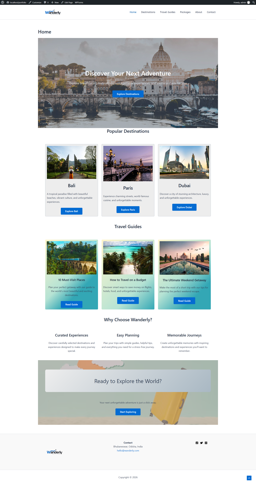
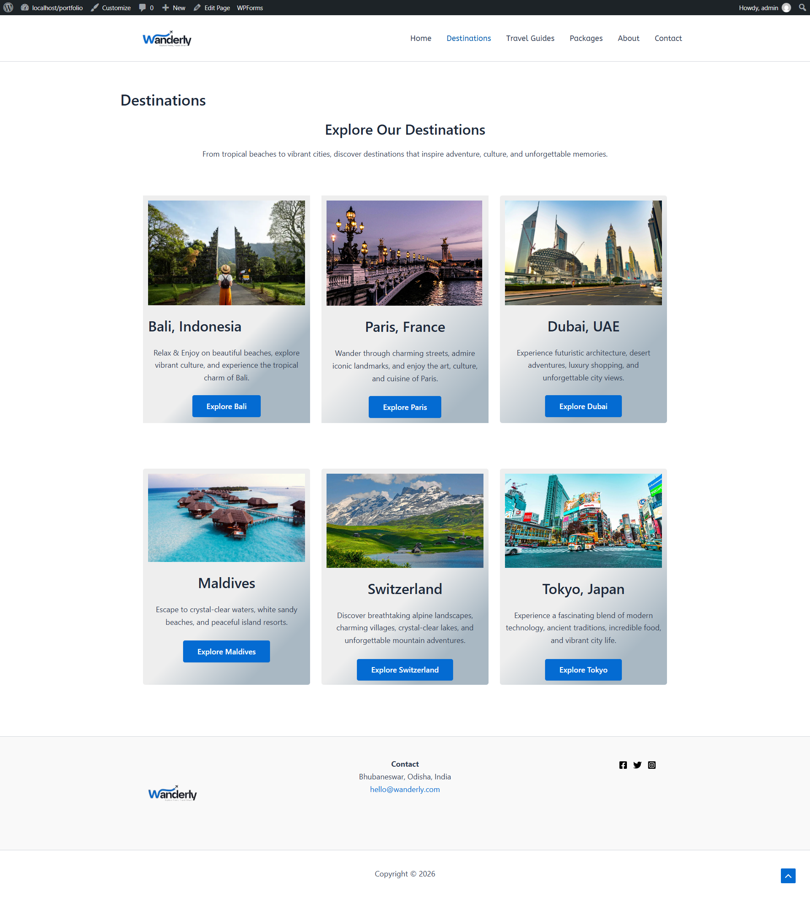

# Wanderly — Travel Website

A modern travel website built with WordPress, designed to provide users with an engaging and visually appealing travel experience.

## ✨ Features

* Responsive travel website
* Modern and clean UI
* Travel destination sections
* Interactive UI elements
* Custom website styling
* WordPress-based content management
* Responsive layout for different screen sizes

## 🛠️ Technologies Used

* WordPress
* PHP
* HTML
* CSS
* JavaScript
* MySQL
* Astra Theme

## 🎨 Project Type

**WordPress Website / UI Design Project**

## 📁 Project Structure

```text
wanderly-wordpress/
├── wp-content/
├── database/
├── astra/
├── twentytwentyfive/
├── twentytwentyfour/
├── twentytwentythree/
└── index.php
```

## 🚀 Local Setup

1. Install a local WordPress environment such as WAMP.
2. Copy the project files into the local WordPress directory.
3. Create the required MySQL database.
4. Import the database backup from the `database` folder.
5. Configure the local WordPress installation.
6. Start Apache and MySQL.
7. Open the project through the local WordPress URL.

## 📸 Screenshots




## 👩‍💻 Author

**Ananya Dash**

Frontend / UI-UX Developer
